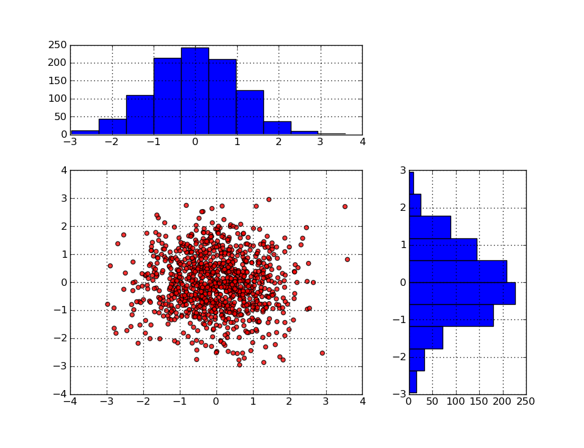

OpenAlea Pylab documentation
###############################

Module description
==================

This is an OpenAlea package that provide a graphical user interface to
`Pylab/Matplotlib <https://matplotlib.org/stable/api/pylab.html>`_ functionalities
as nodes in VisuAlea.

See the User Guide to learn how to create this scatter plot within VisuAlea.

 **Example of dataflow that allows a graphical usage of Matplotlib library.**

Documentation
=============

.. toctree::
    :maxdepth: 1

    User Guide<user/index.rst>   
    Reference Guide<user/autosum.rst>
    Developer Guide <user/todo.rst>
