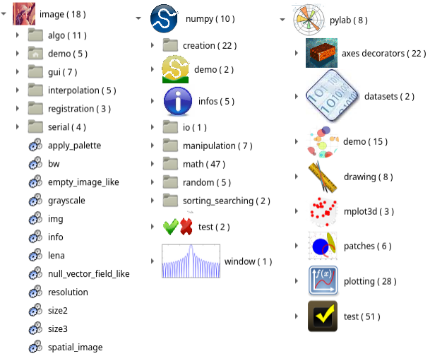

Welcome to Openalea Scipack's documentation!
============================================

 **Example of package explorer entries in Visualea.**

OpenAlea Scientific Python Packages (aka OpenAlea.SciPack) is a set of wrappers of standard Python packages
for `Visualea <https://visualea.readthedocs.io>`_ OpenAlea Visual Programming application).

These packages are not plant related, they do not convey specific scientific knowledge on plant modeling but are
usefull to build efficient visual programs.

1. stdlib: standard logical components based on python libraries.
2. numpy: some `Numpy <https://numpy.org/>`_ functionalities like trigonometric and hyperbolic functions, array manipulation, etc.
3. matplotlib: plotting functionalities from `matplotlib/pylab <https://matplotlib.org/stable/api/pylab.html>`_.
4. image: the possibilities range from image loading/saving to morphology operations or registration.

Contents
========

.. toctree::
    :maxdepth: 1

    Installation <installation.md>
    Stdlib <doc_stdlib/contents.rst>
    Numpy <doc_numpy/contents.rst>
    Pylab <doc_pylab/contents.rst>
    Images <doc_image/contents.rst>

Indices and tables
==================

* :ref:`genindex`
* :ref:`modindex`
* :ref:`search`